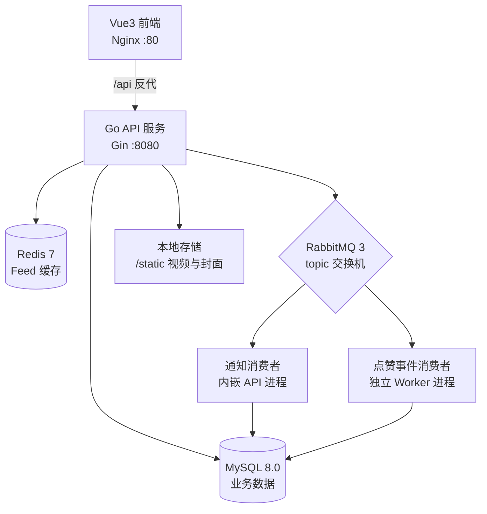

# 视频 Feed 系统

一个功能完整的短视频 Feed 系统，前后端分离架构。后端基于 Go + Gin，前端基于 Vue 3，通过 RabbitMQ 实现互动事件驱动、Redis 缓存热点 Feed，支持 Docker Compose 一键部署。

## 项目简介

本项目实现了类似抖音 / TikTok 的核心功能闭环：用户注册登录、视频上传发布、Feed 浏览、点赞评论、关注粉丝、站内通知。系统在数据一致性、消息可靠性、接口性能等方面做了针对性设计，适合作为全栈学习与面试项目。

## 核心功能

### 用户系统
- 用户注册与登录（JWT 认证，密码 bcrypt 哈希存储）
- 双 Token 机制：access_token（15 分钟）+ refresh_token（7 天）
- Token 无感刷新：refresh_token 一次性轮换（Rotation），CAS 原子更新防并发刷新与重放；前端 401 自动刷新重试，共享 Promise 并发去重
- 个人信息管理（头像上传、简介修改、密码修改）

### 视频功能
- 视频上传与发布（FFmpeg 自动抽取首帧生成封面，支持自定义封面）
- 视频详情、按作者分页查询
- 视频搜索（标题 / 用户名模糊匹配，分页）
- 热门视频推荐（时间衰减热度算法：播放量 / (小时数+100)^1.1，SQL 层计算排序）
- 播放量统计、单个 / 批量删除（软删除）

### 社交互动
- 点赞 / 取消点赞（同步事务写库：记录 + 计数原子提交，唯一索引防重复点赞，GREATEST 防计数扣负）
- 评论发布与列表（LEFT JOIN 一次查出评论者头像，消除 N+1 查询）
- 关注 / 取消关注、粉丝与关注列表、关注关系统计与查询

### 通知系统
- 点赞、评论、关注三类站内通知（RabbitMQ 事件驱动，异步生成）
- 未读通知计数、通知列表（读取后自动标记已读）

### Feed 流
- 最新视频流分页加载
- 首页 Redis 缓存（Cache-Aside 模式，TTL 5 分钟，发布 / 删除视频主动失效）

### 消息队列
- 三个 topic 交换机（like / comment / social 事件），通知消费者单队列通配符绑定统一扇出
- 消息持久化 + 手动 ACK + QoS 限流，解析失败的毒消息直接丢弃不阻塞队列
- 连接断线自动重连（指数退避，上限 30s），MQ 故障时主流程自动降级不影响核心业务

### 架构与工程特性
- 三层架构（Handler → Service → Repo）+ 依赖注入，单向依赖
- 手写令牌桶限流（按 IP 20 QPS / 突发 40，读写锁 + 双重检查 + 过期桶清理）
- 全局 CORS、统一响应格式与错误码、JWT 强制 / 可选双级中间件
- 优雅关闭：信号监听 + 15s 请求排空 + 依次释放 MQ / 数据库连接

## 技术栈

### 后端
- **语言**: Go 1.26
- **Web 框架**: Gin v1.12
- **ORM**: GORM v1.31（MySQL 驱动）
- **缓存**: Redis 7（go-redis v9）
- **消息队列**: RabbitMQ 3（amqp091-go）
- **认证**: JWT（golang-jwt v5，HS256）
- **数据库**: MySQL 8.0
- **视频处理**: FFmpeg（封面抽帧）
- **配置管理**: YAML

### 前端
- **框架**: Vue 3.5（组合式 API）
- **构建工具**: Vite 8
- **语言**: TypeScript 6
- **UI 组件**: Element Plus 2.14
- **路由**: Vue Router 4
- **状态管理**: Pinia 3

### 部署与运维
- **容器化**: Docker（多阶段构建，后端镜像内置 FFmpeg）
- **编排**: Docker Compose（5 个服务，数据卷持久化）
- **反向代理**: Nginx（SPA 回退 + /api 反代 + 静态资源代理）

## 系统架构



## 项目结构

```
feedSystem_video/
├── backend/                    # 后端服务
│   ├── cmd/                    # 入口文件
│   │   ├── api/               # API 服务入口（内嵌通知消费者）
│   │   └── worker/            # 点赞事件消费者入口
│   ├── internal/              # 内部模块
│   │   ├── account/          # 用户账号模块（注册/登录/刷新Token/资料）
│   │   ├── apierror/         # 统一响应与错误码
│   │   ├── auth/             # JWT 签发与解析
│   │   ├── config/           # 配置加载
│   │   ├── db/               # 数据库连接
│   │   ├── feed/             # Feed 流模块
│   │   ├── http/             # HTTP 路由与依赖组装
│   │   ├── middleware/       # 中间件与基础设施
│   │   │   ├── cors/         # 跨域处理
│   │   │   ├── feedcache/    # Feed 缓存 key 统一管理
│   │   │   ├── jwt/          # JWT 中间件（强制/可选）
│   │   │   ├── rabbitmq/     # RabbitMQ 连接、发布、自动重连
│   │   │   ├── ratelimit/    # 令牌桶限流
│   │   │   ├── redis/        # Redis 操作封装
│   │   │   └── storage/      # 上传文件存储（白名单/大小校验）
│   │   ├── notification/     # 通知模块
│   │   ├── social/           # 社交关系模块
│   │   ├── video/            # 视频模块（含点赞、评论）
│   │   └── worker/           # MQ 消费者（通知扇出、点赞事件）
│   ├── configs/              # 配置文件
│   └── uploads/              # 上传文件目录（Docker 卷挂载）
├── frontend/                  # 前端应用
│   ├── src/
│   │   ├── api/              # API 调用封装（client.ts 含 401 无感刷新）
│   │   ├── composables/      # 组合式函数
│   │   ├── router/           # 路由与登录守卫
│   │   ├── stores/           # Pinia 状态（认证）
│   │   └── views/            # 页面组件（首页/热榜/详情/发布/我的/设置）
│   └── nginx.conf            # 生产环境 Nginx 配置
├── sql/                      # 数据库建表脚本
├── docker-compose.yml        # Docker Compose 编排
└── README.md
```

## 快速开始

### 环境要求

- Docker >= 20.10 且 Docker Compose >= 2.0（容器部署）
- Go >= 1.26（本地后端开发）
- Node.js >= 20（本地前端开发）
- FFmpeg（本地开发时视频封面生成；Docker 镜像已内置）

### 使用 Docker 部署

1. 克隆项目并进入目录：
```bash
git clone https://gitee.com/huanghu6/feed-system_video.git
cd feed-system_video
```

2. 按需修改后端配置（数据库、MQ 等连接信息）：
```bash
vim backend/configs/config.yaml
```

3. 启动全部服务：
```bash
docker-compose up -d
```

4. 访问服务：
- 前端页面：http://localhost（80 端口）
- API 服务：http://localhost:8080
- RabbitMQ 管理台：http://localhost:15672（admin / 123456）

> 数据库表由后端启动时 GORM AutoMigrate 自动创建，也可手动执行 `sql/feed_system_video.sql` 初始化。

### 本地开发

#### 后端

```bash
cd backend
go mod tidy

# 启动 API 服务（:8080，内嵌通知消费者）
go run cmd/api/main.go

# 可选：启动点赞事件消费者（独立进程）
go run cmd/worker/main.go
```

#### 前端

```bash
cd frontend
npm install
npm run dev
```

开发服务器运行在 http://localhost:5173 ，Vite 已配置代理：`/api` 前缀请求自动转发到 `http://localhost:8080` 并去除前缀。

## 配置说明

### 后端配置（backend/configs/config.yaml）

| 配置段 | 说明 |
|--------|------|
| `server` | 服务端口、读写超时 |
| `mysql` | 数据库连接、连接池参数、日志级别 |
| `redis` | Redis 连接信息 |
| `jwt` | 签名密钥、access_token / refresh_token 有效期 |
| `rabbitmq` | 消息队列连接信息 |
| `storage` | 上传目录、静态访问路径、FFmpeg 可执行文件路径 |

### 前端配置

- 生产环境：Nginx 将 `/api` 反代至后端、`/static` 代理上传资源（见 `frontend/nginx.conf`）
- 开发环境：Vite proxy 代理 `/api`（见 `frontend/vite.config.ts`）
- 如需自定义 API 地址，可通过环境变量 `VITE_API_BASE` 覆盖（见 `frontend/src/api/client.ts`）

## API 接口

统一约定：
- 响应格式：`{ "code": 0, "message": "success", "data": ... }`，code 非 0 即失败
- 需要登录的接口通过请求头 `Authorization: Bearer <access_token>` 认证
- 全局限流：按客户端 IP 每秒 20 请求、突发 40，超限返回 429

### 认证与账号（/account）

| 方法 | 路径 | 需登录 | 说明 |
|------|------|--------|------|
| POST | /account/register | 否 | 用户注册 |
| POST | /account/login | 否 | 用户登录（返回双 Token） |
| POST | /account/refreshToken | 否 | 刷新 Token（Header 携带 refresh_token，一次性轮换） |
| GET | /account/getProfile | 否 | 获取用户资料与统计（粉丝/关注/视频/获赞数） |
| POST | /account/uploadAvatar | 是 | 上传更新头像（multipart，≤10MB） |
| POST | /account/changePassword | 是 | 修改密码 |
| POST | /account/updateBio | 是 | 更新个人简介 |

### 视频（/video）

| 方法 | 路径 | 需登录 | 说明 |
|------|------|--------|------|
| POST | /video/uploadVideo | 是 | 上传视频文件，FFmpeg 自动生成封面（≤256MB） |
| POST | /video/uploadCover | 是 | 单独上传封面图片 |
| POST | /video/publish | 是 | 发布视频元数据 |
| POST | /video/delete | 是 | 删除视频（仅作者本人，软删除） |
| POST | /video/deleteBatch | 是 | 批量删除视频 |
| GET | /video/listByAuthorID | 否 | 按作者分页查询视频 |
| GET | /video/getDetail | 否 | 获取视频详情 |
| POST | /video/recordPlay | 否 | 记录播放（播放量 +1） |
| GET | /video/listHot | 否 | 热门视频（时间衰减算法排序） |
| GET | /video/search | 否 | 搜索视频（标题/用户名模糊匹配） |

### 点赞（/like）

| 方法 | 路径 | 需登录 | 说明 |
|------|------|--------|------|
| POST | /like/like | 是 | 点赞视频（事务：写记录 + 计数 +1） |
| POST | /like/unlike | 是 | 取消点赞（事务：删记录 + 计数 -1） |
| GET | /like/isLiked | 是 | 查询是否已点赞 |

### 评论（/comment）

| 方法 | 路径 | 需登录 | 说明 |
|------|------|--------|------|
| GET | /comment/listAll | 否 | 评论分页列表（JOIN 带出评论者头像） |
| POST | /comment/publish | 是 | 发表评论（事务：写评论 + 计数 +1） |

### 社交（/social）

| 方法 | 路径 | 需登录 | 说明 |
|------|------|--------|------|
| POST | /social/follow | 是 | 关注用户 |
| POST | /social/unfollow | 是 | 取消关注 |
| GET | /social/isFollowing | 是 | 检查是否已关注 |
| GET | /social/getAllFollowers | 是 | 粉丝列表（分页） |
| GET | /social/getAllVloggers | 是 | 关注列表（分页） |
| GET | /social/getCounts | 是 | 关注/粉丝数统计 |

### Feed 流（/feed）

| 方法 | 路径 | 需登录 | 说明 |
|------|------|--------|------|
| GET | /feed/listLatest | 否 | 最新视频流（首页 Redis 缓存 5 分钟） |

### 通知（/notification）

| 方法 | 路径 | 需登录 | 说明 |
|------|------|--------|------|
| GET | /notification/unreadCount | 是 | 未读通知数 |
| GET | /notification/list | 是 | 通知列表（读取后自动标记已读） |

### 其他

| 方法 | 路径 | 说明 |
|------|------|------|
| GET | /healthz | 健康检查 |
| GET | /static/* | 上传文件静态访问（视频/封面/头像） |

## 数据库设计

数据库脚本位于 `sql/feed_system_video.sql`，包含 6 张表（启动时也可由 GORM 自动迁移创建）：

| 表 | 说明 | 关键设计 |
|----|------|----------|
| `accounts` | 用户账号表 | username 唯一索引、软删除、存储双 Token |
| `videos` | 视频信息表 | 冗余计数字段（点赞/播放/评论数）、软删除 |
| `likes` | 点赞记录表 | (video_id, account_id) 唯一索引防重复点赞 |
| `comments` | 评论表 | video_id / account_id 索引 |
| `socials` | 社交关系表 | (follower_id, vlogger_id) 唯一索引、软删除 |
| `notifications` | 通知表 | recipient_id 索引、已读标记 |

## 许可证

本项目基于 MIT 许可证开源。
